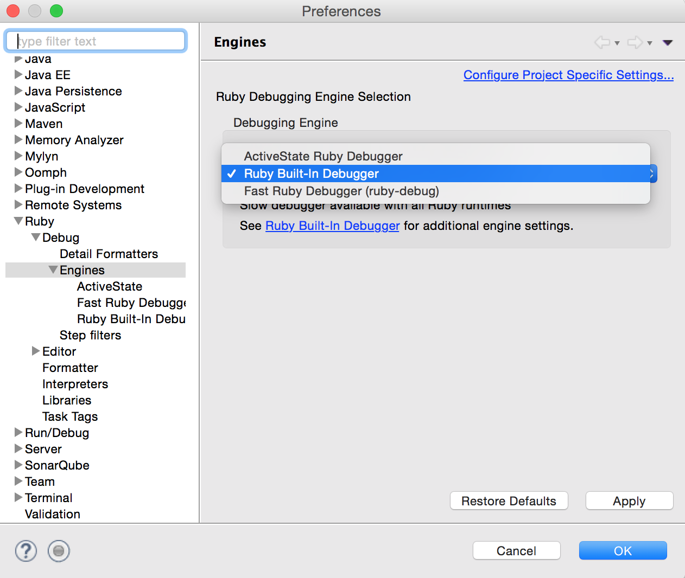

# Advent of Code in Ruby

Fun Coding Puzzles available [here](http://adventofcode.com/)

## Install Ruby
`brew install ruby`

## Setting up Eclipse
Eclipse Dynamic Language Toolkit [for Ruby] (https://eclipse.org/dltk/)

Setting the Debugger

